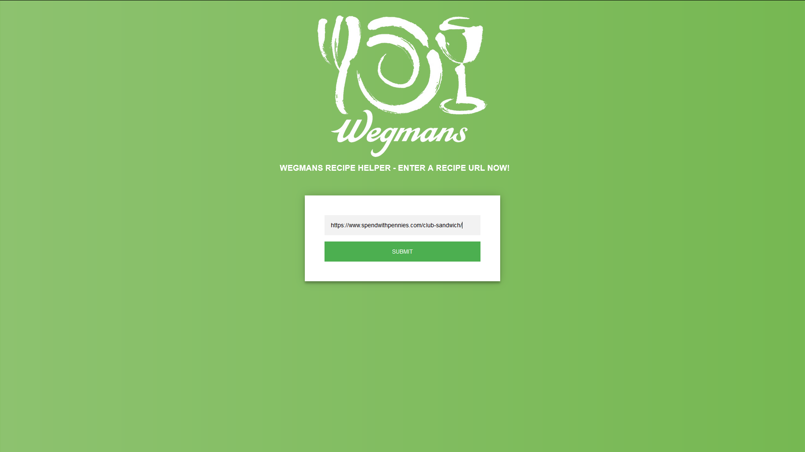
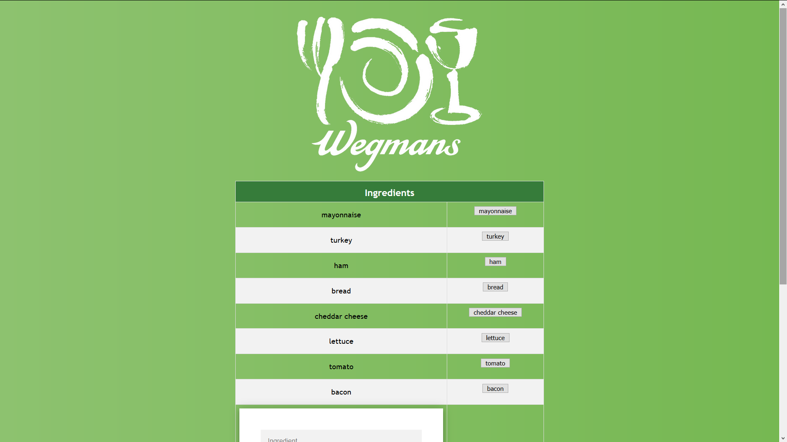

# Wegmans Recipe Helper

Wegmans Recipe Helper is designed to make home cooking easier! Simply input the URL of a recipe on the Web UI and a list of ingredients will be generated. After the customer confirms the ingredients (adding and deleting elements as neccessary), a convenient view is generated for every item–name, price, and location. With this tool, going from recipe to dinner table has never been easier!

### Getting Started
These instructions will get you a copy of the project up and running on your local machine for development and testing    purposes. See deployment for notes on how to deploy the project on a live system.

### Prerequisites

- **Flask** (python web environment): https://flask.palletsprojects.com/en/1.1.x/installation/

- **Google Cloud Natural Langage API**: https://cloud.google.com/natural-language/docs/reference/libraries#client-libraries-install-python, https://cloud.google.com/natural-language/docs/analyzing-entities#language-entities-string-python

- **Wegmans API**: https://dev.wegmans.io/product#product=hackathon (subscribe to the API and apply your own subscription key)

- **BeautifulSoup4** (python web scraping): https://pypi.org/project/beautifulsoup4/

### Usage
To run the flask site on your local network, run these lines on the command line in the directory containing site.py:

>set FLASK_APP=wegSite.py  
>python -m flask run

Then, go to the ip address indicated on the command line.

### Enhancements
With more time or resources this project could be improved by:
- Train our own neural network to properly identify food types
- Identify and display amount of each ingredient neccessary for the recipe
- Deploy to a live environment (web and mobile)
- More substance to the web environment (links, store map, etc.)
- Enhancements for the Wegmans API (more requests per minute, more efficient queries for common items, implementing store locator and recipe features)
- Subscription key rotation / API call caching to reduce requests per minute

### Deployment
Flask has several options and tutorials for deploying to a live environment: https://flask.palletsprojects.com/en/1.1.x/deploying/

### Built With
- Flask - The web framework used
- Google Natural Language API - Entity analysis
- Wegmans API - Used to determine product information
- BeautifulSoup4 - Web scraping

### Authors
- Nick Gardner - Web Scraping
- Ethan Howes - Entity Analysis
- Nate Kushner - Flask Web Design
- Albin Lang - Wegman's API Utilization
